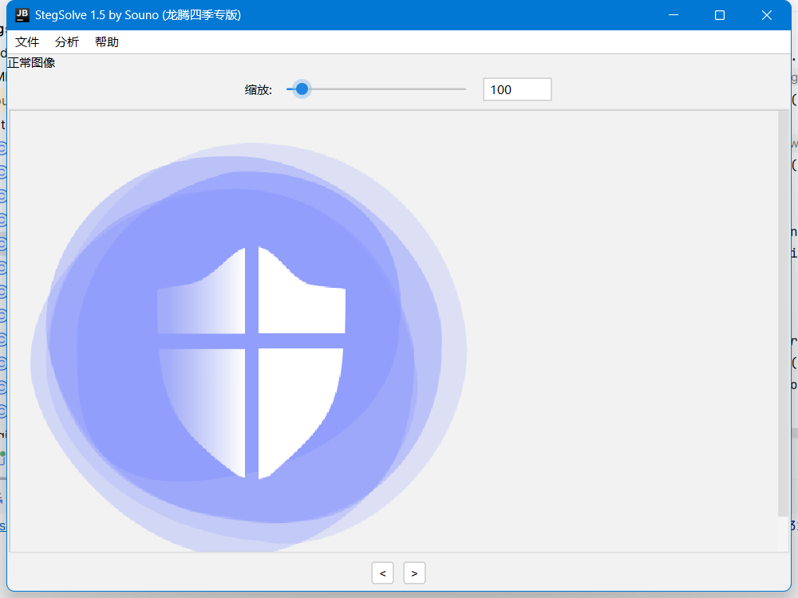

# StegSolve

StegSolve的升级修复版本！

## 1.5 changes

- 汉化部分内容
- 美化界面为Jetbrians风格
- 修复原来1.4版本的帧浏览器、合并图片等功能的不显示图片bug。

## 1.4 changes

- Added zoom to image
- Added drag&drop zone for files
- Added "all" option to channel planes in "Data Extract"
- Added horizontal scrolling (Shift+Mousewheel)

# Special Thanks
Special thanks to [JetBrains](https://www.jetbrains.com) for their support to this project.

